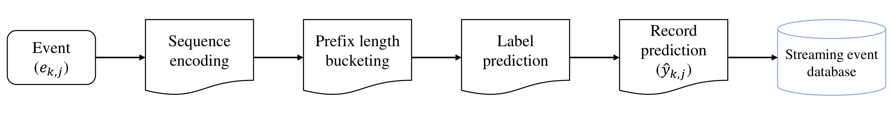
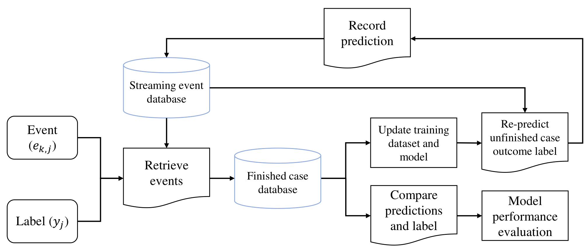
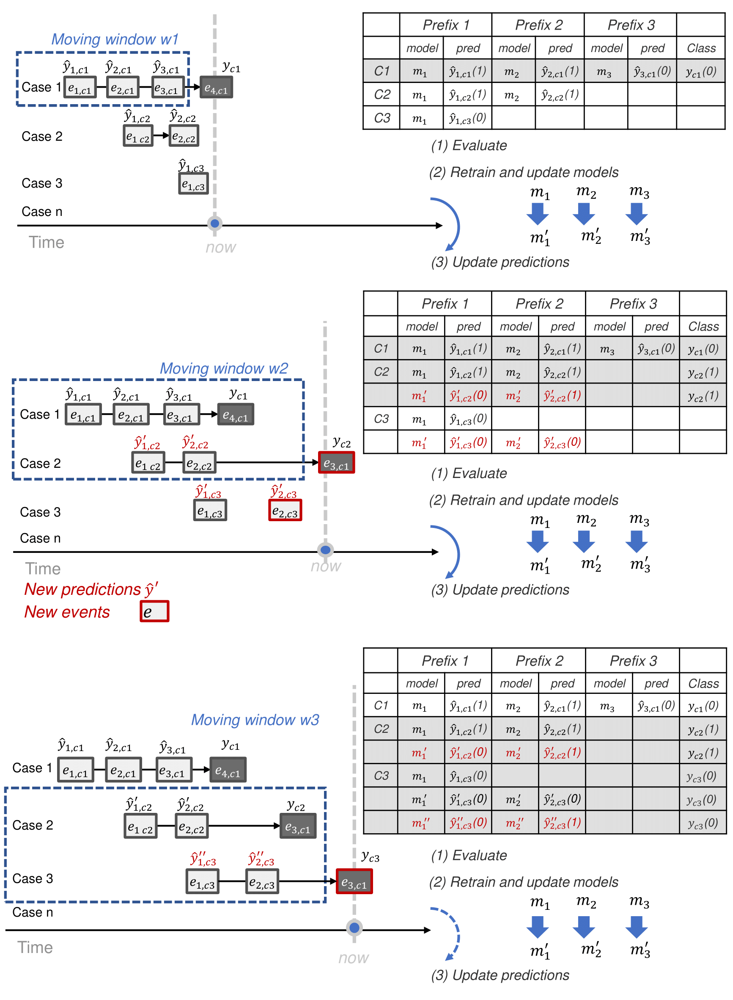

# Continuous performance evaluation for business process outcome monitoring

## Suhwan Leea, Marco Comuzzib, and Xixi Lua

aUtrecht University
bUlsan National Institute of Science and Technology

## General framework

    
     
    <em>1.a)&nbsp Processing of an event without label</em>
    
     
    <em>1.b)&nbsp Processing of an event with label</em>

### In this figure, the processing of one event belonging to trace is schematised.
---

First of all, the labels received are only used to train the models in the framework. The event  may either be the last of , i.e., length of , in which case the label  becomes known, or not. When an event is not the last one of its trace (see Fig. 1.a), it is used to generate a new prefix of  for prefix . Then, a prediction  for the new prefix can be computed using the model for prefix . Receiving the last event , and its label (see Fig. 1.b) enables (i) to evaluate all the predictions  that have been generated for all prefixes  (evaluation before training), (ii) to update the models  owing to the availability of new labelled prefixes. Finally, it is possible (iii) to compute a new set of predicted labels , with  and for all the prefixes for which a label has not been yet received (train and retest).  

## Performance evaluation
### Moving windows and predictive framework

    
     
    <em>2) Updating the moving window of predictions across model updates</em>

### The four meta-measures
#### 1) Frequency of significant performance drop
_“How often the model performance significantly deviated from (below) the moving average?”_

The evaluation metric captures the rate at which the performance of an online predictive model drops below a certain level considered acceptable.

#### 2) Stability of the performance
_"How volatile are the performance values of the prediction framework?"_

The evaluation metric captures the stability over time of the performance of an online predictive model.

#### 3) Magnitude of performance drop

_“How much is the absolute value of deviated performance of the framework?”_

The evaluation metric captures how much the perfor-
mance of a model normally drops from its expected acceptable level.

#### 4) Recovery rate

_“How quickly can the model be recovered from a sudden change in the prediction ability?”_

The evaluation metric measures the speed at which an online model normally recovers from a performance drop.

